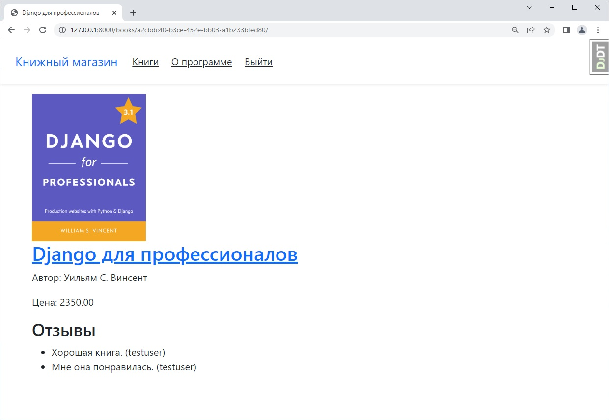

# Bookstore
___


В данном приложении можно регистрироваться, добавлять, редактировать и 
удалять книги, а также отзывы к ним. Реализован поиск по названию книги
или его автору. Возможен просмотр книг как списком, так и по отдельности.




## Настройка перед запуском

Первое, что нужно сделать, это cклонировать репозиторий:

```sh
$ git clone https://github.com/Andrei2020-web/Bookstore.git
$ cd Bookstore
```

Создайте виртуальную среду для установки зависимостей и активируйте ее:

```sh
$ virtualenv venv
$ source venv/bin/activate
```

Затем установите зависимости:

```sh
(venv)$ pip install -r requirements.txt
```

Запускаем сервер:

```sh
(venv)$ python manage.py runserver
```